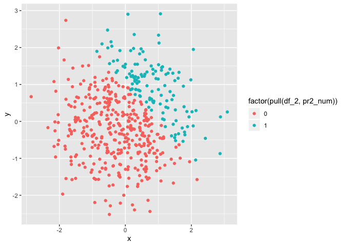
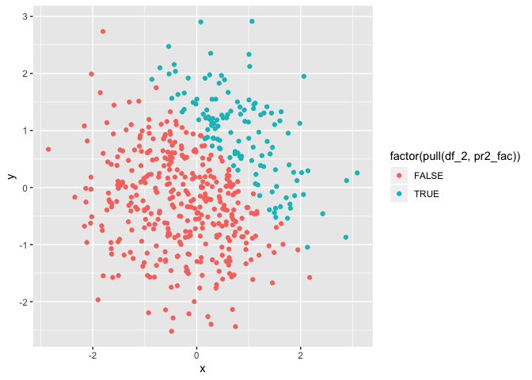

p8105\_hw1\_lef2147
================
Lauren Franks, lef2147

Question 1: create a df with a random sample size of 8 from a normal
distribution, a logical vector indicating whether elements of the sample
are greater than 0, a character vector of length 8, a factor vector of
length 8 with 3 different factor
    “levels”

``` r
library(tidyverse)
```

    ## ── Attaching packages ─────────────────────────────────────── tidyverse 1.2.1 ──

    ## ✔ ggplot2 3.2.1     ✔ purrr   0.3.2
    ## ✔ tibble  2.1.3     ✔ dplyr   0.8.3
    ## ✔ tidyr   0.8.3     ✔ stringr 1.4.0
    ## ✔ readr   1.3.1     ✔ forcats 0.4.0

    ## ── Conflicts ────────────────────────────────────────── tidyverse_conflicts() ──
    ## ✖ dplyr::filter() masks stats::filter()
    ## ✖ dplyr::lag()    masks stats::lag()

``` r
df_1 = tibble(
  pr1_rand = rnorm(8),
  pr1_log = pr1_rand > 0,
  pr1_char = "Hi there",
  pr1_fact = factor(c(1, 2, 3, 2, 3, 1, 2, 1))
)
```

Taking the mean of each variables in the dataframe

``` r
mean(pull(df_1, pr1_rand))
```

    ## [1] -0.5058186

``` r
mean(pull(df_1, pr1_log))
```

    ## [1] 0.375

``` r
mean(pull(df_1, pr1_char))
```

    ## [1] NA

``` r
mean(pull(df_1, pr1_fact))
```

    ## [1] NA

R is only able to calculate the mean for variable pr1\_rand and pr1\_log
because they are either numeric or logical. R is not able to calculate a
mean for a character variable or factor variable because there are no
associated numbers with character or factor variables.

``` r
as.numeric(pull(df_1,pr1_log))
as.numeric(pull(df_1,pr1_char))
as.numeric(pull(df_1,pr1_fact))
```

This output explains what happens when you take the mean for the logical
variable, it sums the zeros and 1s and divides by 8. This also explains
why there is an error message for the character
    variable.

``` r
as.numeric(pull(df_1, pr1_log)) * pull(df_1, pr1_rand)
```

    ## [1] 0.0000000 0.0000000 0.5516889 0.2600561 0.3493009 0.0000000 0.0000000
    ## [8] 0.0000000

``` r
as.factor(pull(df_1, pr1_log)) * pull(df_1, pr1_rand)
```

    ## Warning in Ops.factor(as.factor(pull(df_1, pr1_log)), pull(df_1,
    ## pr1_rand)): '*' not meaningful for factors

    ## [1] NA NA NA NA NA NA NA NA

``` r
X = as.factor(pull(df_1, pr1_log))
as.numeric(X) * pull(df_1, pr1_rand)
```

    ## [1] -0.9317560 -1.2490490  1.1033779  0.5201122  0.6986017 -1.1866999
    ## [7] -1.4683873 -0.3717030

Problem 2 A numeric vector created by coercing the above logical vector
A factor vector created by coercing the above logical vector

``` r
df_2 = tibble(
  x = rnorm(500),
  y = rnorm(500),
  pr2_log = x + y > 1,
  pr2_num = as.numeric(pr2_log),
  pr2_fac = as.factor(pr2_log)
)

sum(pull(df_2, pr2_log))/500
```

    ## [1] 0.254

The size of the dataframe `df_2` is 500 rows and 5 columns. The mean of
the datafram is -0.03, the median is 0.04, and the standard deviation is
0.99. The proportion of cases which x + y \> 1 is 0.254.

``` r
plot_1 = ggplot(df_2, aes(x = x, y = y, color = 'red')) + geom_point()

ggplot(df_2, aes(x = x, y = y, color = factor(pull(df_2, pr2_num)))) + geom_point()
```

<!-- -->

``` r
ggplot(df_2, aes(x = x, y = y, color = factor(pull(df_2, pr2_fac)))) + geom_point()
```

<!-- --> The
scatterplots are being colored the same way regardless if you use
pr2\_fac or pr2\_num. This is because they are essentially transmitting
the same information, the numeric variable is transmitting information
via “1” and “0” whereas the factor variable is using TRUE and FALSE.
